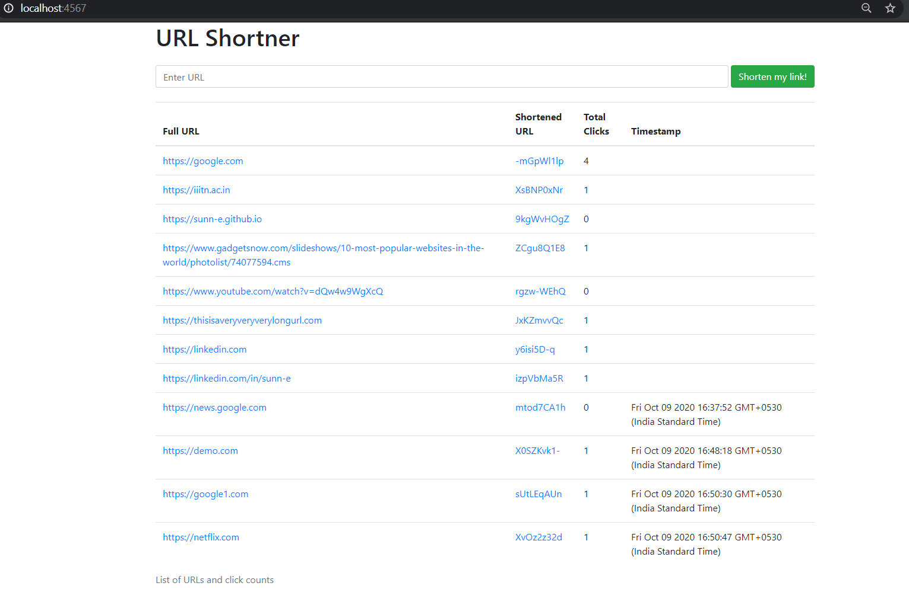

# YouRL
A url shortner web app in Node.js, Express and MongoDB.

 

## Features

- Convert any URL to short URL
- Click counter
- Timestamps of link submission
- Super easy to deploy. Refere to deploy section for more.

## In Action

## dependencies

express- Web framework

mongoose- To connect mongodb to our webapp

ejs- Templating language to create views

### Commands

`npm i express mongoose ejs`

### dev dependencies

`npm i --save-dev nodemon`

//npm install -g nodemon

`nodemon server.js`
For refreshing server for every new change. Makes life easy.

### mongodb on windows

tip: Make sure you have admin access

- to access db

"C:\Program Files\MongoDB\Server\4.4\bin\mongod.exe" --dbpath="c:\data\db"

- to start mongodb server

"C:\Program Files\MongoDB\Server\4.4\bin\mongo.exe"

## Deploy

### Local Device

1. Make sure you have mongodb intalled and running. I used `db` as my database name. You can do the same.
1. Fork the repo, clone it locally.
1. Open terminal and run `node ./server.js`
1. Open any web browser and visit `localhost:4567`
1. (Optional) If you want to devlop the app,run `nodemon server.js`instead of `node ./server.js`, every new change will be reflected in your browser.

### Heroku

1. Fork this repository
1. Create a free Heroku Account
1. Create free Heroku app with your github fork

## Roadmap

- A login Screen
- protected routes with JWT
- Heroku deploy button
